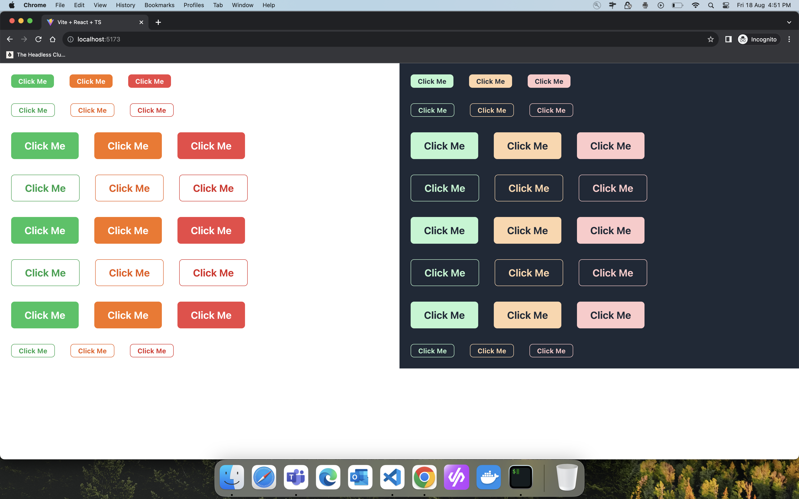
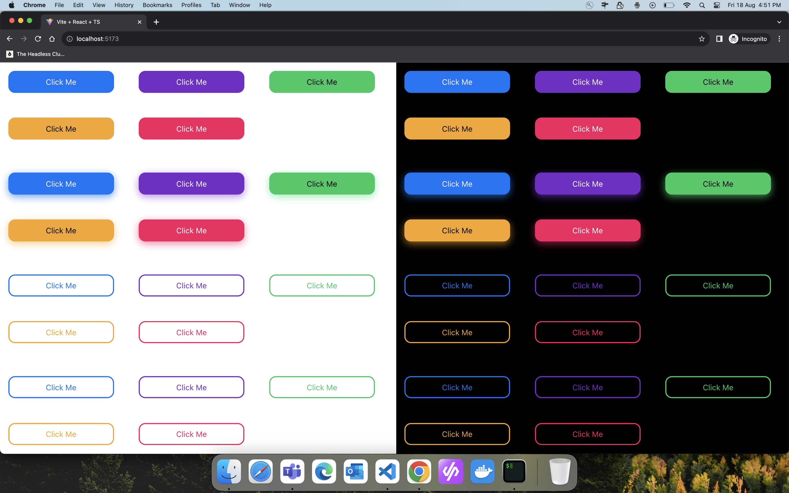
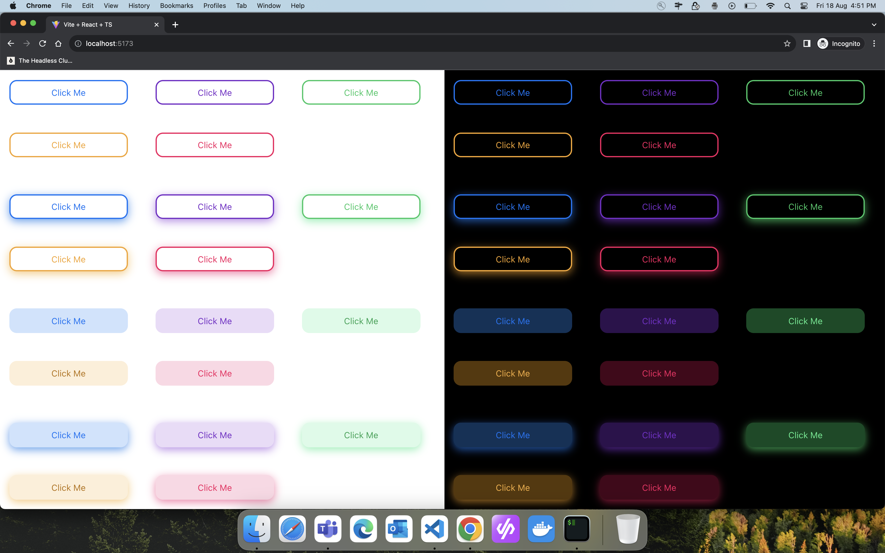
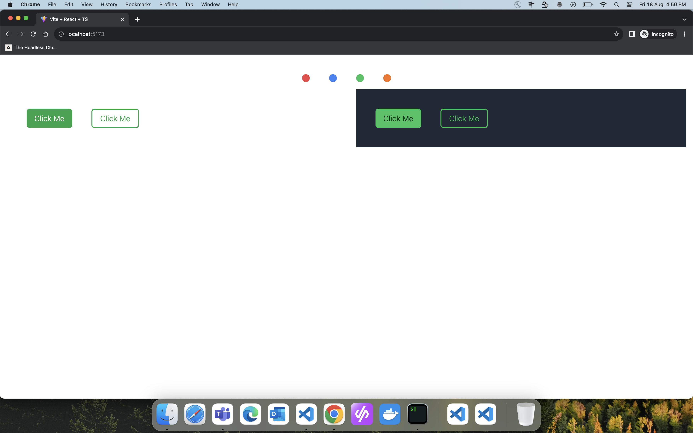

# Themable Design System with PandaCSS & React.

Welcome to the Themable Design System repository! This project demonstrates the power of the amazing Panda CSS library and React, in creating versatile and customizable themeable components and design systems.

## Branches

### 1. Chakra Clone Button (Branch: chakra-ui)

In this branch, a button component inspired by Chakra UI has been created. The theme tokens from Panda CSS have been utilized, and theming for the light and dark mode is acheived as follows -

```ts
{
      colorScheme: "green",
      variant: "solid",
      css: {
        bg: "green.500",
        color: "white",
        _hover: {
          bg: "green.600",
          _disabled: {
            bg: "green.500",
          },
        },
        _active: {
          bg: "green.700",
        },

        _dark: {
          bg: "green.200",
          color: "gray.800",
          _hover: {
            bg: "green.300",
            _disabled: {
              bg: "green.200",
            },
          },
          _active: {
            bg: "green.400",
          },
        },
      },
    },
```



### 3. Styled Button (Branch: styled-chakra-ui)

In the `styled-chakra-ui` branch, we use the styled function from PandaCSS to create styled components and eliminate the need of using css() function altogether.

```tsx
// without styled
<Button
   className={css({ m: "5px" })}
   variant="outline"
   colorScheme="orange"
>
   Click Me
</Button>

// with styled
<Button m="5px" variant="outline" colorScheme="orange">
   Click Me
</Button>
```

### 3. Next UI Button with Dual Themes (Branch: next-ui)

In the `next-ui` branch, the button component takes advantage of separate theme tokens for light and dark modes. By changing the theme class on the root component, colors are automatically applied, eliminating the need for the `_dark` selector.





### 4. Shad UI with Multiple Themes (Branch: shad-ui)

Drawing inspiration from Shad CDN, the `shad-ui` branch implements multiple themes, including green, orange, blue, and red. Experience a variety of visually appealing themes and explore the potential of Panda CSS.



Feel free to explore these branches to see the different approaches to theming and design system creation. Happy coding!
